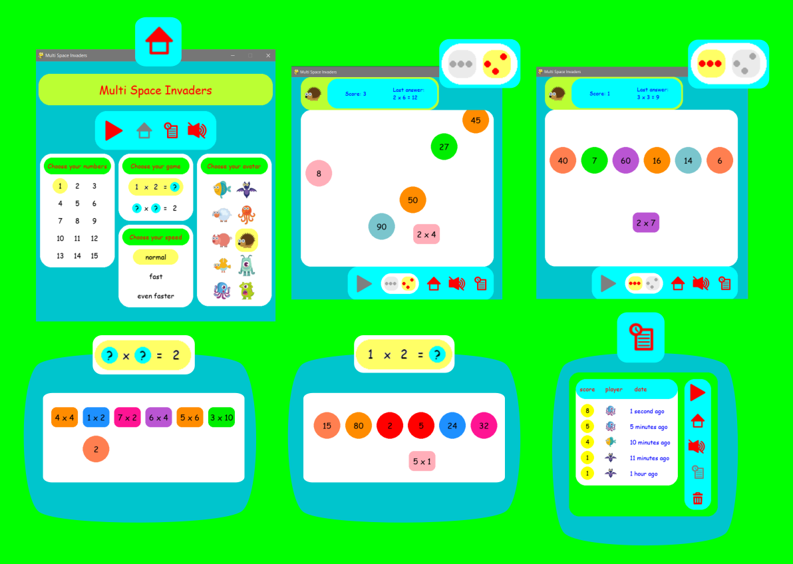
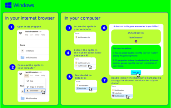

# Multi-invaders 

A game for practicing multiplication tables ([Screenshots](Documentation/GameInfo.png))

----- 
# Game program

If you are using Windows, you can download the game without the need of installing python in your computer. 

You can download the zip file with the game from [dropbox here](https://www.dropbox.com/scl/fi/bqdibjbjd9vypn6iwigb4/MultiInvaders.zip?rlkey=a76jmu5bafar8kd3jyffa5mp0&dl=0) or from the lastest realease in GitHub [here](https://github.com/lennon-c/MultiInvaders/releases/latest/download/MultiInvaders.zip) and then follow the [Installation instructions.](Documentation/InstallInfo.png)

----- 
# Running the game using python 

## requirements

Make sure that you have installed the required packages listed in [requirements.txt](Documentation/Requirements/requirements.txt)

If you use pipenv to manage your virtual environments, you can install requirements using the following [Pipfile](Documentation/Requirements/Pipfile)

> [!NOTE]
> **Main packages:**
> 
> *For running the game:*
> - pygame 
> - lorem-text (to create random text for testing text sizes)
> - babel (to make time stamps readable for humans)
> 
> *For packaging game into executable:*
> - pyinstaller (it creates the game exe file)
> - pywin32 and winshell (for creating shortcuts)

## Instructions
 
1. Clone or download the code into your computer.
2. To start the game, run the Main.py script.
   
	a. If you are running the script from you python editor, set the folder where the Main.py file is located as your working directory 

---- 
# References 

## Code
I created this game after reading the book of Irv Kalb on Object-Oriented programming.[^1]
Some parts of the code in this game are very much influenced by the code of Irv Kalb, particularly the code relating to Scenes' creation and management (you can find the original code at [pyghelpers](https://github.com/IrvKalb/pyghelpers)) and the code for the construction of *text buttons* (the original code can be found in [pygwidgets](https://github.com/IrvKalb/pygwidgets))

## Assets 
- Avatar monsters are designed by <a href="https://www.freepik.com/free-vector/set-colorful-monsters_1988053.htm#query=set-colorful-monsters&position=41&from_view=search&track=sph">Freepik</a>
- Avatar animals are  <a href="https://www.freepik.com/free-vector/cartoon-animals-icon-set_1488201.htm#page=2&query=Katemangostar%20animals%20icon&position=40&from_view=search&track=ais">designed by katemangostar</a> on Freepik
- All the other assets such as buttons were designed by me using [Inkscape](https://inkscape.org/)

[^1]: Kalb, I. (2022). Object-Oriented Python: Master OOP by Building Games and GUIs. United States: No Starch Press.

